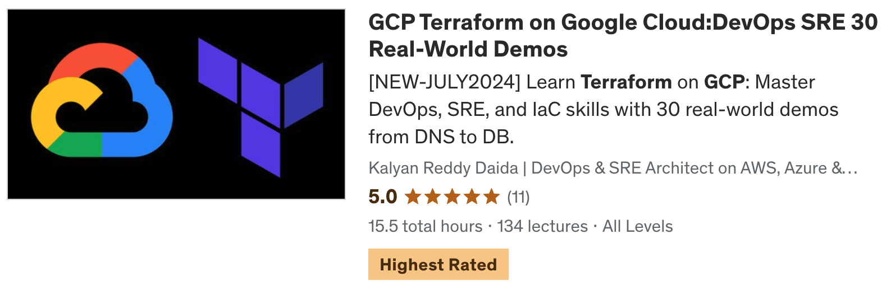

# [GCP Terraform on Google Cloud:DevOps SRE 30 Real-World Demos](https://stacksimplify.com/courses/gcp-terraform/)

## [Course Details](https://stacksimplify.com/courses/gcp-terraform/)
- **Title:** [GCP Terraform on Google Cloud:DevOps SRE 30 Real-World Demos](https://stacksimplify.com/courses/gcp-terraform/)
- **Sub Title:** Learn Terraform on GCP: Master DevOps, SRE, and IaC skills with 30 real-world demos from DNS to DB.

## [Course Modules](https://stacksimplify.com/courses/gcp-terraform/)
1. **Demo-01:** Install CLI Tools: gcloud CLI, Terraform CLI, VSCode Editor  
2. **Demo-02:** Terraform Commands (init, validate, plan, apply and destroy)  
3. **Demo-03:** Terraform Language Basics  
4. **Demo-04:** Terraform Meta-Argument - Provider (Multiple Providers Demo)  
5. **Demo-05:** Terraform Input Variables and Output Values  
6. **Demo-06:** Terraform Meta-argument: count  
7. **Demo-07:** Terraform Datasources  
8. **Demo-08:** Terraform Meta-argument: for_each  
9. **Demo-09:** Terraform Local Values, GCP Instance Templates  
10. **Demo-10:** GCP Managed Instance Groups with Terraform  
11. **Demo-11:** GCP Regional Application Load Balancer HTTP  
12. **Demo-12:** GCP MIG Private IP with Cloud NAT and Cloud Router  
13. **Demo-13:** GCP Managed Instance Group Update Policy  
14. **Demo-14:** GCP Certificate Manager with Self-signed SSL for Regional ALB  
15. **Demo-15:** GCP Cloud Domains and Cloud DNS  
16. **Demo-16:** GCP Cloud DNS + Certificate Manager Production grade SSL Certificates  
17. **Demo-17:** GCP Load Balancer with Context Path-based Routing  
18. **Demo-18:** GCP Load Balancer with Domain Name based Routing  
19. **Demo-19:** GCP Load Balancer with Header based Routing  
20. **Demo-20:** GCP Cloud Logging - Send Application Logs to Cloud Logging  
21. **Demo-21:** GCP Cloud Monitoring: Uptime Checks, Alert Policy and Metrics  
22. **Demo-22:** GCP Cloud SQL Public IP + Terraform Remote Backend as Cloud Storage  
23. **Demo-23:** DNS To DB: LB (Self-signed SSL) + UMS + Cloud SQL Public IP  
24. **Demo-24:** DNS To DB: LB (Production grade SSL) + UMS + Cloud SQL Public IP  
25. **Demo-25:** GCP Cloud SQL Private IP  
26. **Demo-26:** DNS To DB: LB (Self-signed SSL) + UMS + Cloud SQL Private IP  
27. **Demo-27:** DNS To DB: LB (Production grade SSL) + UMS + Cloud SQL Private IP  
28. **Demo-28:** Terraform Modules: Use Public modules from Terraform Registry  
29. **Demo-29:** Terraform Modules: Create Terraform Custom Module for VM Instance  
30. **Demo-30:** GCP DevOps with Cloud Build and GitHub for Terraform Code  
31. **Demo-31:** GCP Global Application Load Balancer HTTP			

## [Terraform Concepts covered](https://stacksimplify.com/courses/gcp-terraform/)
1. Terraform Commands  
2. Terraform Providers  
3. Terraform Settings Block  
4. Terraform Resources  
5. Terraform Local Backends  
6. Terraform Remote Backends  
7. Terraform Input Variables  
8. Terraform Output Values  
9. Terraform Local Values  
10. Terraform Remote State Datasource  
11. Terraform Template Functions  
12. Terraform Meta-argument Provider  
13. Terraform Meta-argument count  
14. Terraform Meta-argument for_each  
15. Terraform Datasources  
16. Terraform Public Modules  
17. Terraform Custom Modules Development  
18. Terraform Functions  

## [GCP Services](https://stacksimplify.com/courses/gcp-terraform/)
1. Google Compute Engine VM Instances  
2. Google Compute Engine VM Instance Templates  
3. Google Compute Engine Health Checks  
4. Google Compute Engine Instance Groups  
5. Google Compute Engine Persistent Disks  
6. Google Cloud VPC  
7. Google Cloud Firewalls  
8. Google Cloud Storage  
9. Google Cloud Monitoring  
10. Google Cloud Logging  
11. Google Cloud Load Balancing  
12. Google Cloud IAM  
13. Google Cloud Domains  
14. Google Cloud DNS  
15. Google Cloud NAT  
16. Google Cloud Router  
17. Google Cloud External IP  
18. Google Cloud Build  
19. Google Cloud Certificate Manager  
20. Google VPC Private Service Connection

## [What will students learn in your course?](https://stacksimplify.com/courses/gcp-terraform/)
1. You will learn to install essential CLI tools including gcloud CLI, Terraform CLI, and VSCode Editor.
2. You will learn to execute fundamental Terraform commands such as init, validate, plan, apply, and destroy.
3. You will learn to understand the basics of Terraform language and its syntax.
4. You will implement and manage multiple providers in Terraform using meta-arguments.
5. You will learn to utilize input variables and output values to parameterize and retrieve data in Terraform configurations.
6. You will learn to leverage the count meta-argument to create multiple resources dynamically.
7. You will learn to use Terraform data sources to fetch data from external systems.
8. You will implement the for_each meta-argument to iterate over collections and create resources.
9. You will learn to define and use local values in Terraform and work with GCP Instance Templates.
10. You will configure and manage GCP Managed Instance Groups using Terraform.
11. You will set up a GCP Regional Application Load Balancer with HTTP support.
12. You will implement a GCP Managed Instance Group with Private IP, Cloud NAT, and Cloud Router.
13. You will configure update policies for GCP Managed Instance Groups.
14. You will use GCP Certificate Manager to create self-signed SSL certificates for Regional ALBs.
15. You will learn to manage GCP Cloud Domains and Cloud DNS for domain registrations and DNS configurations.
16. You will integrate GCP Cloud DNS with Certificate Manager to obtain production-grade SSL certificates.
17. You will configure GCP Load Balancers with context path-based routing.
18. You will implement domain name-based routing with GCP Load Balancers.
19. You will set up header-based routing on GCP Load Balancers.
20. You will send application logs to GCP Cloud Logging for centralized log management.
21. You will implement GCP Cloud Monitoring with uptime checks, alert policies, and custom metrics.
22. You will configure GCP Cloud SQL with Public IP and use Cloud Storage as Terraform remote backend.
23. You will deploy an end-to-end application with DNS, self-signed SSL, UMS, and Cloud SQL Public IP.
24. You will secure your application with production-grade SSL certificates using Cloud SQL Public IP.
25. You will set up GCP Cloud SQL with Private IP for enhanced security.
26. You will integrate self-signed SSL, UMS, and Cloud SQL Private IP for a complete deployment.
27. You will secure the entire stack with production-grade SSL, UMS, and Cloud SQL Private IP.
28. You will utilize public Terraform modules from the Terraform Registry.
29. You will create custom Terraform modules for VM instances.
30. You will implement GCP DevOps using Cloud Build and GitHub to automate Terraform code deployments.
31. You will set up and manage a GCP Global Application Load Balancer with HTTP support.

## [What are the requirements or prerequisites for taking your course?](https://stacksimplify.com/courses/gcp-terraform/)
- You need to have basic knowledge of Google Cloud Platform
- To create Google Cloud Account, you need a debit or credit card 
- You don't need any prior knowledge of Terraform. We will start from the very basics of Terraform. The first 9 demos will focus on Terraform fundamentals.

## [Who is this course for?](https://stacksimplify.com/courses/gcp-terraform/)
- This course is designed for students who are planning to automate Google Cloud Infrastructure using Terraform
- Students who planning to learn Terraform on Google Cloud Platform

## [Github Repositories used for this course](https://stacksimplify.com/courses/gcp-terraform/)
- [terraform-on-google-cloud](https://github.com/stacksimplify/terraform-on-google-cloud)
- [terraform-gcp-devops](https://github.com/stacksimplify/terraform-gcp-devops)
- [Course Presentation](https://github.com/stacksimplify/terraform-on-google-cloud/tree/main/course-presentation)
- **Important Note:** Please go to these repositories and FORK these repositories and make use of them during the course.

## [Each of my courses come with]((https://stacksimplify.com/courses/gcp-terraform/)
- Amazing Hands-on Step By Step Learning Experiences
- Practical demos for each and every concept
- Friendly Support in the Q&A section
- "30-Day "No Questions Asked" Money Back Guaranteed by Udemy"

## My Other AWS Courses
- [Udemy Enroll](https://www.stacksimplify.com/azure-aks/courses/stacksimplify-best-selling-courses-on-udemy/)

## Instructor Profile
- [Kalyan Reddy Daida - StackSimplify](https://stacksimplify.com/about/)

# HashiCorp Certified: Terraform Associate - 50 Practical Demos
 

# AWS EKS - Elastic Kubernetes Service - Masterclass

# Azure Kubernetes Service with Azure DevOps and Terraform 

# Terraform on AWS with SRE & IaC DevOps | Real-World 20 Demos

# Azure - HashiCorp Certified: Terraform Associate - 70 Demos

# Terraform on Azure with IaC DevOps and SRE | Real-World 25 Demos

# [Terraform on AWS EKS Kubernetes IaC SRE- 50 Real-World Demos](https://stacksimplify.com/courses/terraform-aws-eks/)

# [Helm Masterclass: 50 Practical Demos for Kubernetes DevOps](https://stacksimplify.com/courses/helm-masterclass/)

---

## My Other Courses (383,000+ Students, 20 Courses)

> All courses available at [stacksimplify.com/courses](https://stacksimplify.com/courses/)

### AWS Courses

| Course | Students | Rating |
|--------|----------|--------|
| [AWS EKS Kubernetes Masterclass](https://stacksimplify.com/courses/aws-eks-masterclass/) | 70,041+ | 4.6 (5,495 ratings) |
| [AWS VPC Transit Gateway](https://stacksimplify.com/courses/aws-vpc-transit-gateway/) | 52,243+ | 4.6 (790 ratings) |
| [Terraform on AWS with SRE and IaC DevOps](https://stacksimplify.com/courses/terraform-on-aws-sre/) | 31,006+ | 4.6 (3,347 ratings) |
| [Terraform on AWS EKS Kubernetes IaC SRE](https://stacksimplify.com/courses/terraform-aws-eks/) | 26,929+ | 4.5 (2,238 ratings) |
| [HashiCorp Certified: Terraform Associate (AWS)](https://stacksimplify.com/courses/hashicorp-terraform-associate-aws/) | 16,835+ | 4.6 (1,754 ratings) |
| [AWS CloudFormation Simplified](https://stacksimplify.com/courses/aws-cloudformation/) | 16,223+ | 4.3 (1,469 ratings) |
| [AWS Fargate and ECS Masterclass](https://stacksimplify.com/courses/aws-fargate-ecs/) | 15,208+ | 4.4 (1,051 ratings) |
| [AWS CodePipeline CI/CD](https://stacksimplify.com/courses/aws-codepipeline/) | 9,832+ | 4.0 (966 ratings) |
| [AWS Elastic Beanstalk Master Class](https://stacksimplify.com/courses/aws-elastic-beanstalk/) | 7,588+ | 4.3 (373 ratings) |
| [Ultimate DevOps Real-World Project on AWS](https://stacksimplify.com/courses/ultimate-devops-real-world-project-on-aws/) | 4,772+ | 4.72 (358 ratings) |

### Azure Courses

| Course | Students | Rating |
|--------|----------|--------|
| [Azure Kubernetes Service with Azure DevOps and Terraform](https://stacksimplify.com/courses/azure-aks-devops-terraform/) | 48,551+ | 4.6 (6,196 ratings) |
| [Terraform on Azure with IaC DevOps SRE](https://stacksimplify.com/courses/terraform-on-azure/) | 17,918+ | 4.7 (1,911 ratings) |
| [Azure HashiCorp Certified: Terraform Associate](https://stacksimplify.com/courses/hashicorp-terraform-associate-azure/) | 16,938+ | 4.5 (1,985 ratings) |
| [Azure Kubernetes Service AGIC Ingress](https://stacksimplify.com/courses/azure-aks-agic/) | 2,012+ | 4.6 (112 ratings) |

### GCP Courses

| Course | Students | Rating |
|--------|----------|--------|
| [GCP Google Kubernetes Engine GKE with DevOps](https://stacksimplify.com/courses/gcp-gke-kubernetes/) | 8,769+ | 4.4 (779 ratings) |
| [GCP Associate Cloud Engineer Certification](https://stacksimplify.com/courses/gcp-associate-cloud-engineer/) | 6,007+ | 4.6 (599 ratings) |
| [GCP Terraform on Google Cloud](https://stacksimplify.com/courses/gcp-terraform/) | 2,600+ | 4.4 (213 ratings) |
| [GCP GKE Terraform on Google Kubernetes Engine](https://stacksimplify.com/courses/gcp-gke-terraform/) | 2,040+ | 4.6 (155 ratings) |

### DevOps and General

| Course | Students | Rating |
|--------|----------|--------|
| [Helm Masterclass: 50 Practical Demos](https://stacksimplify.com/courses/helm-masterclass/) | 12,069+ | 4.7 (915 ratings) |
| [Docker in a Weekend: 40 Practical Demos](https://stacksimplify.com/courses/docker-weekend/) | 3,802+ | 4.6 (361 ratings) |

---

## Instructor Profile
- [Kalyan Reddy Daida - StackSimplify](https://stacksimplify.com/about/)

---

## Connect with Me
- [YouTube - Cloud & DevOps Tutorials](https://www.youtube.com/@stacksimplify)
- [LinkedIn - Kalyan Reddy](https://www.linkedin.com/in/kalyan-reddy/)
- [GitHub - StackSimplify](https://github.com/stacksimplify)

---

